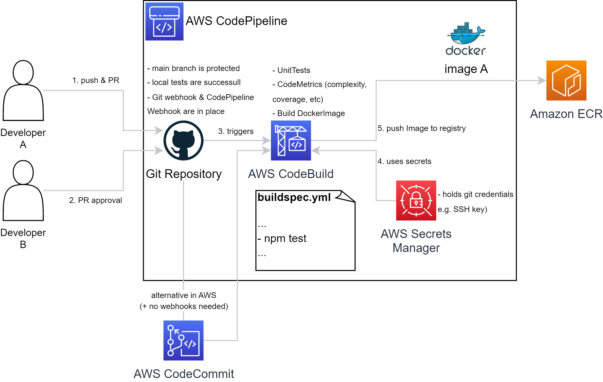

# Automated Deployment concept

**_NOTE:_** I wanted to use as many AWS Services as possible, but also show alternatives.

1. Developer A is working on a new Feature. After successfull local testing, Developer A pushes all changes and opens a new Pull Request (PR). Doing that more test cases can run through. If those tests are successull, proceed.
2. Developer B can approve the PR.  
Codebase can be in 2 different locations (of course many more, but here, I just want to highlight 2):  

3. In a **Git Repo** based on own server. Or in **AWS CodeCommit** in the cloud. 
Advantages of Git Repo: we own the full codebase. 
Advantages of AWS CodeCommit: Easy&Quick integration with other AWS Services (CodeBuild, IAM etc.) 
**AWS CodeBuild** for building the Image gets triggered. (directly via CodeCommit, or via Git webhook and CodePipeline webhook). Within the builspec.yml of CodeBuild, we can run multiple steps:   
*pre_build* (npm install) 
*build* (npm test) 
*post_build* (docker build / docker push to **ECR**)
4. If needed CodeBuild can use secrets from **AWS Secrets Manager**  (e.g. SSH key to access Git Repo).
5. Push final Image to a registry. Here **Harbor** or **Amazon ECR** would be 2 options.
Advantages of Harbor: we own the Image and can do scannings. 
Advantages of ECR: Easy&Quick integration with other AWS Services (ECS, Fargate, IAM etc.) 

**_NOTE:_** Important steps in the automated deployment process:

- Use a version control (Git)
- Use a pipeline to orchestrate everything (GH Actions, Jenkins, AWS CodePipeline)
- Define steps in the pipeline (Unit tests, integration test, manual approvals, etc.)
- After creating a new Image, release a new version in a registry (Harbor, ECR)
- In the pipeline firstly publish to a test env (not really needed for this small project)
- Monitoring!
- Configuration management (e.g. setting env variables, e.g. port or DB connections etc.)
